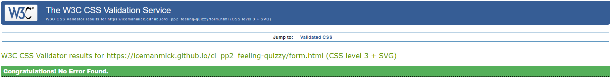

# Feeling Quizzy

[Live Webpage](https://icemanmick.github.io/ci_pp2_feeling-quizzy/)

## Table of Contents

1. [Introduction](#introduction)
    1. [Background](#background)
2. [Objectives](#objectives)
    1. [Site Visitors](#site-visitors)
    2. [Site Owners](#site-owners)
3. [User Stories](#user-stories)
4. [Website Design](#website-design)
    1. [Layout](#layout)
    2. [Colour Choices](#colour-choices)
    3. [Wireframes](#wireframes)
    4. [Structure](#structure)
    5. [Font](#font)
5. [Feautures](#features)
    1. [Feature1-etc]
    2. [Form](#form)
    3. [Social Media](#social-media)
    4. [Future Ideas](future-ideas)
6. [Testing](#testing)
    1. [HTML Validation](#html-validation)
    2. [CSS Validation](#css-validation)
    3. [JavaScript Validation](#javascript-validation)
    4. [Performance](#performance)
    5. [Accessibility](#accessibility)
    6. [Browsers](#browsers)
    7. [Devices](#devices)
7. [Unfixed Bugs](#unfixed-bugs)
8. [Deployment](#deployment)
9. [Technology Used](#technology-used)
10. [Credits](#credits)
    1. [Content](#content)
    2. [Media](#media)
11. [Final Thoughts](#final-thoughts)

## Introduction

### Background
"Feeling "Quizzy" is a fun, interactive, multi-choice answer quiz website. In keeping with the tradition of pub quiz team names being pun based, "Feeling Quizzy" is based phonetically off the phrase "feeling dizzy".

The overall tone of the website is lighthearted and sometimes tongue-in-cheek. The purpose of the website is to provide a fun and interactive experience for the user, while at the same time possibly being educational.

The quiz itself consists of 20 questions from four different categories with four possible answers. In all cases, only one answer is correct, however, some of the answers themselves are ficticious. 

To provide a level of difficulty and uncertainty, some answers, such as year numbers, are deliberately similar. This is to make the user second guess themselves on an answer they would have initially been confident of. 

## Objectives

### Site Visitors
The objectives of the site visitors can be split into two categories:
1. First Time Visitors;
2. Return Visitors.

#### First Time Visitors:
- May wish to test themselves for fun.
- May wish to practice for an upcoming pub quiz where real prizes can be won.
- Can take the quiz to educate themselves on the categories covered in the questions.
- Can use the quiz with friends at parties they host/attend.
- May play the quiz to pass their time leisurely e.g. if travelling on public transport or in a waiting room.

#### Returning Visitors
In addition to having the same objectives as First Time Visitors, Returning Visitors:
- May attempt to better their previous score.
- May attempt to better their previous time.
- Can check if new questions or categories have been added.
- Can sign up for a an email newsletter to receive updates.

### Site Owners
The objectives of the site owners are:
- To provide a quiz in a format that is generally accepted and familiar to the public.
- To provide an enjoyable experience for users.
- To provide an interactive experience to users.
- To to provide a fun, and at times, humourous experience to users.
- To educate users on categories they may not be strong with.
- To provide reusability of content.
- To receive detailed feedback from users.
- To encourage users to sign up for the email newsletter, which has potential for commericial purposes, such as advertisement or future merchandise selling.

## User Stories

### First Time Users
1. As a first time user, I want to know what the purpose of the website is.
2. As a first time user, I want to know what categories are covered in the quiz.
3. As a first time user, I want to know what is the tone of this website and is this quiz going to be fun.
4. As a first time user, I want to know is the website easy to use.

### Returning Users
5. As a returning user, I want to know if the questions are in the same order.
6. As a returning user, I want to know if what happens if I run out of time.
7. As a returning user, I want to know if the site owners have a social media presence and how can I find it.
8. As a returning user I want to know if the future categories are being updated.
9. As a returning user, I want to know if I can receive updates without visiting the website.

### Site Owners
10. As a site owner, I want to my website to be visually appealing and easy to navigate.
11. As a site owner, I want users to know that the tone of this website is lighthearted and tongue-in-cheek.
12. As a site owner, I want to update users with upcoming categories.
13. As a site owner, I want to gather important feedback from users.
14. As a site owner, I want to encourage users to sign up for the email newsletter.

## Website Design

### Layout
Quiz websites should be simple and easy to navigate. The steps to start and finish a quiz should be obvious and the answer buttons should be large and appropriately spaced so that distinct answer selection is not a problem.

With too many features or complexes designs, a user may be put off, and may seek an alternative quiz option. The internet is full of interactive quizzes to choose from, so simplicity of design and execution is important to not only encourage game commencement, but also repeat visits.

The website consists of four pages:

- Home Page
- Quiz Page
- News and Feedback Page
- Timeout Page (should the user not complete the quiz in the alotted time)

### Colour Choices
The main colours used in the website are a blue/navy colour called rgba (25, 50, 190, 0.75), and a standard Light Blue with Whitesmoke borders on the buttons. These colours are in honour of the Dublin GAA jersey colours, as I'm from Dublin in Ireland.

rgba (25, 50, 190, 0.75)

Dublin Jersey

The traffic lights colours of Red, Gold, and Limegreen were used for hovering over buttons and button clicks.

A second light purple/pink colour was used to provide some additional variety and distinction, without being visually jarring. This colour is called rgba (208, 71, 107,0.95).

rgba (208, 71, 107, 0.95)

Whitesmoke background was used again on the footer to alert the user to the bottom of the page and its social media links.

### Structure
Each page structure is similar with the main purpose of the page in a large heaidng at the top and a social media footer at the base. The main content (menus, answers, forms) are centrally located. This consistency ensures a positive visitor experience as the visitor never has to go looking for something; information is always where it is expected to be.

The symmetry of the four current categories on the home page and the four upcoming categories on the newsletter sign up page serve as "book-ends" to the website.

### Wireframes
Wireframes were created using the programme Balsamiq.

Home

Quiz

Form

Timeout

### Font
Roboto from [Google Fonts](https://fonts.google.com/specimen/Roboto) is used for the website. Alternative fallback font used is Sans-Serif.

## Features

### Simplistic Design
-Due to the simple design and layout of the website, user's know immediately what purpose and objectives of the website are.
-The website name is declared large and centered in the users view, and greets them with the immediate challenge of testing their knowledge.
- User stories satisfied: Number 1, 2, 4, 10

### Categories Covered
- A list of catgories covered in the quiz are present on the home page.
- Pictures accompany the list and [Font Awesome](https://fontawesome.com/sessions/sign-in) icons were added to the list items.
- User stories satisfied: Number 1, 2, 10

### Menu
- The  colours used throughout the website indicate a lighthearted and fun tone.
- The language used on the menus is familiar and colloquial, so as to not seem to formal or serious.
- The 'I'm Ready To Test Myself!!"
- The "Let Me Check Something First..." menu option brings the user to an external Google home page, the joke being that as you never know what will show up on a quiz, it's impossible to study for.
-The "This Might Be More My Speed..." menu option brings the user to an online drawing and colouring app, jokingly suggesting they may not be intellectually capable for what in reality is a simple straightforward quiz.
- User stories satisfied: Number 3, 11

### Site Navigation

- With bright colours, large fonts, and centralised large buttons,the site is very intuitive and easy to navigate.
- User stories satisfied: Number 4, 10

### Question Randomisation

- Return users will note that the questions bank is randomised each time a new game is started. This adds some element of variety and resusablity before the quiz is updated with new categories/questions.
- User stories satisfied: Number 5
 

### Timeout

- Initially, the quiz consists of 20 questions from four categories with four possible answers to each question.
- The game itself is limited to 10 minutes to maintain user attention and discourage cheating.
- Once the timer reaches zero, and if all the questions are not yet answered, the user will be brought to the Timeout Page where they can return to the main menu.
- User stories satisfied: Number 6

### Social Media
- Social media linke are present at the footer of each page for easy access. 
- Icons were sourced from [Font Awesome](https://fontawesome.com/sessions/sign-in).
- User stories satisfied: Number 7

### Upcoming Categories and Newsletter
-The Upcoming Categories section informs users of future categories that are to be added to the website.
-The plan would be to initially update on a monthly basis, subject to feedback and engagement.
- Signing up for the monthly newsletter is encouraged.
- The newsletter via email enables the site owner to update users without them having to visit the website and could potentially be used for commerical purposes, such as advertising and/or merchandise.
- User stories satisfied: Number 2, 8, 9, 12, 13, 14

### Feedback
- The newsletter also allows the user to provide feedback/comments to the site owner, which could be invaluable in terms of improving the sites offering and/or interactivity/functionality.
- User stories satisfied: Number 13, 14

### "Don't Cheat!" Button
- As a pyschological joke, I've included a "Don't Cheat" button on the main quiz page.
- Clicking the button does not pause the timer or offer any advantage but calls out the user for trying to cheat with a pop up. Just a small feature to make the user smile.
-User stories satisfied: Number 3, 11

### Timer and Score Counter
- Both features allow the user to track their progress.
- User stories satisfied: Number 6

### Form Validation
- When filing out and submitting the feedback form, if the email address is correctly validated, a green pop up acknowledgment appears under the form.
-Similarly, if the email address is not correctly validated, a warning message appears.
User stories satisfied: Number 13, 14

### Future Ideas
- Future ideas would be to incorporate new types of questions and challenges
- To add additional questions to existing categories
- To new categories with questions

## Testing

Testing was conducted over seven main categories:
1. HTML Validation
2. CSS Validation
3. JavaScript Validation
4. Performance
5. Accessibility
6. Browsers
7. Devices

Each of the below four webpages were tested in the above categories:

1. Home
2. Quiz
3. News and Feedback
4. Timeout Page

### HTML Validation
The HTML of each webpage was passed through the [W3c HTML Validator Website](https://validator.w3.org/). Each page returned no errors.

Home

Quiz

Form

Timeout

### CSS Validation
Each webpage was passed through the [W3C CSS Validator Website](https://jigsaw.w3.org/css-validator/) also known as "Jigsaw". Each page returned no errors.

Home

Quiz

Form

Timeout

### JavaScript
Each webpage was passed through [JSHint JavaScript Validator](https://jshint.com/).

### Performance
The Lighthouse feature in Google Chrome Developer Tools was used to test the performance of each webpage.

Home

Quiz

Form

Timeout

### Accessibility>
The [WAVE Web Accessibility Evaluation Tool](https://wave.webaim.org/) was used to test the accessibility of the website.

Home

Quiz

Form

Timeout
</details

### Browsers
All webpages have been tested on the following browsers:
- Google Chrome
- Safari
- Internet Explorer

### Devices
All webpages have been tested on the following devices:
- Lenovo Z50 laptop
- iPad
- OnePlus 7 mobile phone

## Deployment

This website was deployed using Github Pages. The steps for deployment on Github Pages are as follows:
1. Select Github repository: IcemanMick/ci_pp2_feeling-quizzy.
2. Click "Settings" option on the navigation menu.
3. Scroll down through the settings to the "Github Pages" section and click on it.
4. On the source section "Branch Menu", click on the drop down menu and select "Branch: Main".
5. Once clicked, an URL to the website will appear.
6. Please note, it may take a few minutes to load, but the link will work and bring you to "FeelingQuizzy" website.

Please find a live link to the website above the Table of Contents title on thie README.md and additionally here: 

## Technology Used

- Git
- GitHub
- GitHub Pages
- Gitpod
- Balsamiq
- HTML
- CSS
- JavaScript
- Google Chrome
- Internet Explorer
- Safari
- Font Awesome
- Google Fonts
- Snipping Tool

## Credits

### Content

### Media

## Final Thoughts